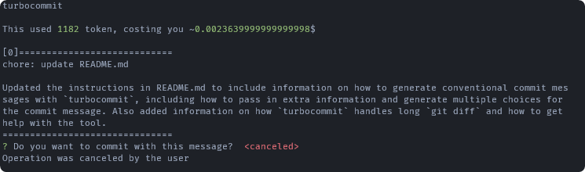
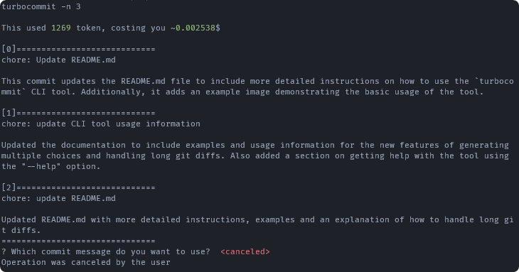
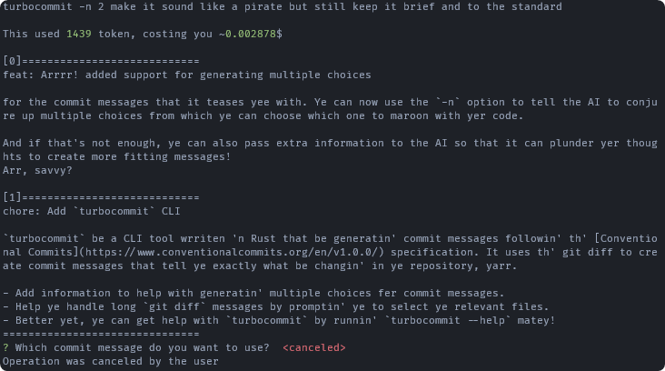

# turbocommit


[`turbocommit` is a CLI tool written in Rust](https://crates.io/crates/turbocommit) that generates commit messages in accordance with the [Conventional Commits](https://www.conventionalcommits.org/en/v1.0.0/) specification. It uses the git diff to create commit messages that accurately reflect the changes made to a repository.

## Installation

turbocommit can be easily installed with Cargo, Rust's package manager. Simply run the following command:

```bash
cargo install turbocommit
```

Please note that in order to use turbocommit, you will need to set the `OPENAI_API_KEY` environment variable. This API key is required to use the OpenAI `gpt-3.5-turbo` language model, which is used by turbocommit to generate commit messages.

## Usage

### Generating Conventional Commits with `turbocommit`

To use `turbocommit`, simply run the command `turbocommit` in your terminal.

```bash
$ turbocommit
```

This will generate one choice for the commit message and ask you whether you want to commit with it. You can then choose to commit with the generated message or not.



---

You can also pass in extra information to the AI to influence the generated commit message. Simply add the information as an argument to the command.

```bash
$ turbocommit this is extra information
```

This will pass the extra information to the AI to generate the commit message.

---

Additionally, you can generate multiple choices for the commit message by using the `-n` option followed by the number of choices you want to generate.

```bash
$ turbocommit -n 3
```

This will generate three choices from which you can choose which one to commit with.



You can also pass in extra information to the AI to influence the generation of multiple choices by adding it as an argument.


```bash
$ turbocommit -n 2 make it sound like a pirate
````

This will generate three choices and pass the extra information to the AI to generate the commit messages.



### Handling Long `git diff`

In some cases, the `git diff` for staged changes may be too long to fit within the 4096-token limit enforced by the language model, which `turbocommit` uses to generate commit messages. When this happens, `turbocommit` will prompt you with a message indicating that the `git diff` is too long.

To address this, `turbocommit` provides a list of all staged files and ask you to select any number of them. The tool will then generate a new `git diff` that includes only the changes from the selected files. If the resulting `git diff` plus the system prompt is still too long, `turbocommit` will repeat the process until the `git diff` is short enough to be processed by the AI model.

This allows you to generate conventional commit messages with `turbocommit` while ensuring that the `git diff` is short enough to be processed by the AI model.

### Getting Help with `turbocommit`

To get help with using `turbocommit`, you can use the `-h` or `--help` option

```bash
$ turbocommit --help
```

This will display the help message with information on how to use the tool.